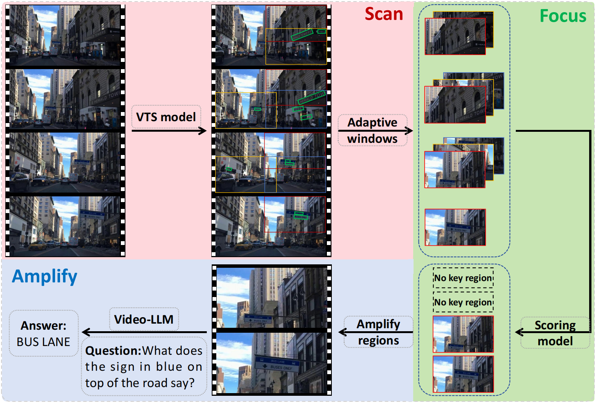

<h1 align="center"> SFA<a href="http://arxiv.org/abs/2511.20190">"></a>


<p align="center">
<h4 align="center">This is the official repository of the papers <a href="http://arxiv.org/abs/2511.20190">SFA: Scan, Focus, and Amplify toward Guidance-aware Answering for Video TextVQA</a>.</h4>
<h5 align="center"><em>Haibin He, Qihuang Zhong, Juhua Liu, Bo Du, Peng Wang, Jing Zhang</em></h5>
<p align="center">
  <a href="#introduction">Introduction</a> |
  <a href="#news">News</a> |
  <a href="#usage">Usage</a> |
  <a href="#statement">Statement</a>
</p>


# Introduction

<figure>

</figure>


1. We identify the limitations of existing Video TextVQA methods and Video-LLMs, and introduce **SFA**, the first training-free Video-LLM-based method tailored for the Video TextVQA task, which integrates visual text perception with video content comprehension to enable more accurate answering.
2. To effectively guide the model’s attention toward key textual regions, we instantiate a three-step *Scan–Focus–Amplify* strategy, inspired by the human question-answering process: it first adaptively scans video frames to identify candidate areas, then filters and selects the most relevant text regions, and finally amplifies these regions to enhance textual clarity and improve answer accuracy.


# News

***26/11/2025***

- The paper is uploaded to arxiv! 


# Usage
### Dataset

You should first download [M4-ViteVQA](https://github.com/bytedance/VTVQA) and [RoadTextVQA](https://github.com/georg3tom/RoadtextVQA), then organize the data as follows:

```
|- datasets
		|--- M4-ViteVQA
		|      |--- video
		|            |--- 00000.mp4
		|            └--- ...
		|      └--- Annotations
		|            |--- ViteVQA_0.0.2_t1s1val.json
		|            └--- ...
		|
		|--- RoadTextVQA
		|      |--- videos
		|            |--- 1.mp4
		|            └--- ...
		|      |--- train.json
		|      |--- val.json
		|      └--- test.json
```


### Installation

Python_3.10 + PyTorch_2.6.0 + CUDA_12.2

```python
git clone https://github.com/Hxyz-123/SFA.git
cd SFA
conda create -n sfa python=3.10
conda activate sfa
pip install -r requirements.txt
cd GoMatching/third_party
sh install.sh
```

### Pre-trained model 

We share the trained [GoMatching weight](https://drive.google.com/file/d/19kN1H8n7m6zjTXuKGWQlZnGSAuGxvQUm/view?usp=drive_link) we use in SFA. You can download it to `./GoMatching/models`. 


### Evaluation

```python
sh examples/qwen_infer.sh
```


# Statement

This project is for research purpose only. For any other questions please contact [haibinhe@whu.edu.cn](mailto:haibinhe@whu.edu.cn).


## Citation

If you find SFA helpful, please consider giving this repo a star and citing:

```bibtex
@article{he2025sfa,
  title={SFA: Scan, Focus, and Amplify toward Guidance-aware Answering for Video TextVQA},
  author={He, Haibin and Zhong, Qihuang and Liu, Juhua and Du, Bo and Wang, Peng and Zhang, Jing},
  journal={arXiv preprint arXiv:2511.20190},
  year={2025}
}
```


